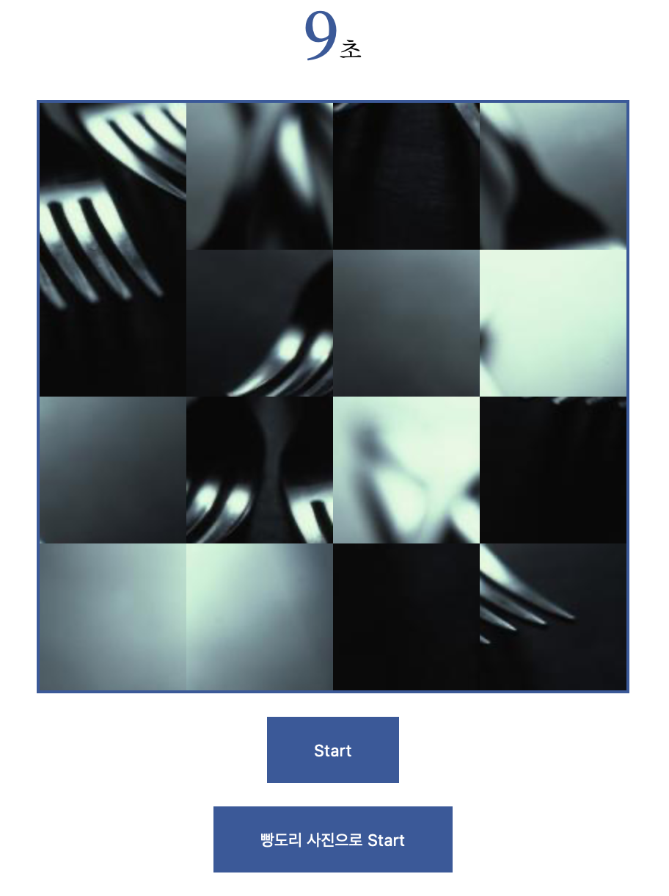

# PuzzleGame
Vanilla javascript로 구현한 퍼즐게임입니다.<br>
여자친구의 요청으로 빵돌이 사진으로 Start 하는 기능을 추가하였습니다!<br><br>

## 게임방법
1. https://jirongkim.github.io/PuzzleGame/ 접속
2. Start / 빵도리 사진으로 Start 버튼 누르기
3. 온전한 사진이 5초간 보여진 후 뒤죽박죽 섞이게 됩니다
4. 마우스를 이용하여 뒤섞인 퍼즐을 원래 사진으로 맞추면 됩니다 <br><br>

## 기능설명
1. 랜덤이미지 혹은 로컬 이미지를 불러와서 드래그, 좌표 설정해주기(정답 이미지로 사용하기 위함)


```
for (var i = 0; i < IMAGE_NUM; i++) { // IMAGE_NUM = 16
    newList.push(document.createElement("li"));
    newList[i].setAttribute('id', 'list' + i);
    newList[i].setAttribute('draggable', 'true');

    if(!isBBang){
      newList[i].style.background = "url(https://picsum.photos/400/400/?random&t=" + random;
    }
    else {
      newList[i].style.background = `url('${imgFolder}${random}.jpeg')`;
      newList[i].style.backgroundSize = "400px 400px";
    }

    GameImage.appendChild(newList[i]);

    newList[i].style.backgroundPosition = -pos_x + 'px ' + -pos_y + 'px';
    console.log(-pos_x + 'px ' + -pos_y + 'px');

    pos_x += 100;
    if (pos_x == (Math.sqrt(IMAGE_NUM) * 100) && i != 0) {
      pos_x = 0;
      pos_y += 100;
    } 
    // IMAGE_NUM (4*4 or 5*5 ...)의 개수에 맞게 backgroundPosition을 설정해줍니다.

    answerTiles[i] = newList[i];
    // 생성시킨 사진을 정답으로 사용합니다.
  }
```
<br><br>

2. shuffle 함수를 통해 무작위로 이미지를 섞기
```
function shuffle(array) {
  let index = array.length - 1;
  while (index > 0) {
    const randomIndex = Math.floor(Math.random() * (index + 1));
    [array[index], array[randomIndex]] = [array[randomIndex], array[index]]
    // 이 코드를 통해 1:1로 섞이게 됩니다.
    index--;
  }
  return array;
  // 무작위로 섞인 배열을 return 합니다.
}
```

<br><br>
## 전체 디자인
